# Sequence Diagram: SOAP Generation & ICD-10 Suggestion (Actual Implementation)

> Tài liệu này mô tả flow thực tế của hệ thống dựa trên codebase hiện tại.

## Overview

- **Architecture**: Frontend-driven direct API calls (không có BullMQ queue)
- **STT Service**: `healthcare.187-127-103-1.nip.io`
- **Database**: Supabase (PostgreSQL)
- **Real-time**: WebSocket streaming transcript

---

## Sequence Diagram (Mermaid)

```mermaid
sequenceDiagram
    autonumber
    participant Doctor as 👨‍⚕️ Bác sĩ<br/>(Doctor Portal)
    participant Frontend as Frontend<br/>(React + Hooks)
    participant WS as WebSocket<br/>(STT Stream)
    participant STT as STT API<br/>(Module 5/6)
    participant Supabase as Supabase<br/>(PostgreSQL)
    participant Storage as Supabase<br/>Storage

    %% ═══════════════════════════════════════════════════════════════
    %% PHASE 1: START RECORDING
    %% ═══════════════════════════════════════════════════════════════
    
    rect rgb(240, 248, 255)
        Note over Doctor,Storage: Phase 1: Bắt đầu ghi âm
        
        Doctor->>Frontend: Nhấn "Ghi âm" (consent confirmed)
        Frontend->>STT: POST /stt/sessions<br/>{appointment_id, doctor_id}
        STT-->>Frontend: {session_id, ws_url}
        
        Frontend->>WS: Connect WebSocket (ws_url)
        WS-->>Frontend: onConnected
        
        Frontend->>Frontend: startPcmCapture()<br/>MediaRecorder.start(250ms)
        
        Note over Frontend: isRecording = true<br/>soapJobStatus = 'streaming'
    end

    %% ═══════════════════════════════════════════════════════════════
    %% PHASE 2: REAL-TIME STREAMING
    %% ═══════════════════════════════════════════════════════════════
    
    rect rgb(255, 250, 240)
        Note over Doctor,Storage: Phase 2: Streaming thời gian thực
        
        loop Mỗi 250ms chunk audio
            Frontend->>WS: sendPcmChunk(audioData)
            WS-->>Frontend: onPartial(text, speaker)
            Frontend-->>Doctor: Hiển thị streamingDraft<br/>(chữ đang gõ)
        end
        
        WS-->>Frontend: onFinalTurn({speaker, text})
        Frontend->>Frontend: setTranscript([...prev, turn])
        Frontend-->>Doctor: Cập nhật transcript panel
        
        opt Fallback: WS lỗi
            Note over Frontend: wsFailedRef = true
            loop Mỗi 1.2s polling
                Frontend->>STT: POST /stt/transcribe (audio blob)
                STT-->>Frontend: {transcript, turns}
                Frontend-->>Doctor: Cập nhật transcript
            end
        end
    end

    %% ═══════════════════════════════════════════════════════════════
    %% PHASE 3: STOP RECORDING & PROCESS
    %% ═══════════════════════════════════════════════════════════════
    
    rect rgb(255, 245, 238)
        Note over Doctor,Storage: Phase 3: Kết thúc ghi âm & Xử lý
        
        Doctor->>Frontend: Nhấn "STOP"
        
        Frontend->>Frontend: stopRecording()<br/>collectRecordedAudio()
        Note over Frontend: soapJobStatus = 'transcribing'
        
        Frontend->>WS: stop()
        WS-->>Frontend: Final turns từ WS
        Frontend->>WS: disconnect()
        
        alt Transcript rỗng (WS failed)
            Frontend->>STT: POST /stt/transcribe<br/>{audioBlob, diarize: true}
            STT-->>Frontend: {transcript, turns}
        end
        
        Frontend->>Frontend: setTranscript(finalTurns)
    end

    %% ═══════════════════════════════════════════════════════════════
    %% PHASE 4: SAVE AUDIO & TRANSCRIPT
    %% ═══════════════════════════════════════════════════════════════
    
    rect rgb(240, 255, 240)
        Note over Doctor,Storage: Phase 4: Lưu audio & transcript
        
        Frontend->>Storage: Upload audio blob<br/>(consultation-audios bucket)
        Storage-->>Frontend: {storagePath, signedUrl}
        
        par Parallel saves
            Frontend->>Supabase: INSERT consultation_recordings<br/>{audio_storage_path, transcript_snapshot}
        and
            Frontend->>Supabase: UPSERT voice_sessions<br/>{transcript_raw, audio_url}
        end
        
        Supabase-->>Frontend: Success
        Frontend-->>Doctor: "Đã lưu bản ghi âm và transcript"
    end

    %% ═══════════════════════════════════════════════════════════════
    %% PHASE 5: AI SOAP GENERATION
    %% ═══════════════════════════════════════════════════════════════
    
    rect rgb(255, 255, 224)
        Note over Doctor,Storage: Phase 5: AI sinh SOAP Note
        
        Frontend->>Frontend: generateSoap(turns)
        Note over Frontend: soapJobStatus = 'generating'
        
        Frontend->>STT: POST /nlp/analyze<br/>{transcript}
        STT-->>Frontend: NlpAnalyzeResult<br/>{complaints, symptoms, red_flags}
        
        Frontend->>STT: POST /nlp/soap<br/>{transcript, complaints, symptoms}
        STT-->>Frontend: NlpSoapResult<br/>{subjective, objective, assessment, plan}
        
        Frontend->>Frontend: formatSoapFields(soap)<br/>→ {s_text, o_text, a_text, p_text}
    end

    %% ═══════════════════════════════════════════════════════════════
    %% PHASE 6: ICD-10 RAG SUGGESTION
    %% ═══════════════════════════════════════════════════════════════
    
    rect rgb(255, 240, 245)
        Note over Doctor,Storage: Phase 6: ICD-10 RAG Suggestion
        
        Frontend->>STT: POST /icd10/rag<br/>{complaints, symptoms, transcript}
        
        Note over STT: Backend xử lý:<br/>1. Embed a_text<br/>2. Semantic Search (pgvector?)<br/>3. Re-rank Top 5
        
        STT-->>Frontend: {icd10: [{code, name_vi, confidence, evidence}], summary}
        
        Frontend->>Frontend: Sort by confidence<br/>Slice top 5
        Frontend->>Frontend: Cache in memory<br/>(hashIcdCacheKey)
    end

    %% ═══════════════════════════════════════════════════════════════
    %% PHASE 7: SAVE TO DATABASE
    %% ═══════════════════════════════════════════════════════════════
    
    rect rgb(230, 230, 250)
        Note over Doctor,Storage: Phase 7: Lưu vào Database
        
        Frontend->>Supabase: RPC save_soap_draft<br/>{s_text, o_text, a_text, p_text}
        Note over Supabase: Encrypt SOAP fields<br/>Update medical_examinations
        Supabase-->>Frontend: exam_id
        
        Frontend->>Supabase: RPC saveSoapAiBaseline<br/>{ai_baseline snapshot}
        
        loop Mỗi ICD code (top 5)
            Frontend->>Supabase: RPC upsert_icd_code<br/>{icd_code, icd_name, confidence, reason}
            Note over Supabase: INSERT soap_icd_codes<br/>confirm_status = 'PENDING'
        end
        
        Supabase-->>Frontend: Success
        
        Note over Frontend: soapJobStatus = 'done'
        Frontend-->>Doctor: "Đã tạo SOAP Note từ AI"<br/>Hiển thị SOAP + Top 5 ICD-10
    end

    %% ═══════════════════════════════════════════════════════════════
    %% PHASE 8: DOCTOR REVIEW
    %% ═══════════════════════════════════════════════════════════════
    
    rect rgb(255, 228, 225)
        Note over Doctor,Storage: Phase 8: Bác sĩ kiểm duyệt
        
        Doctor->>Frontend: Review SOAP Note<br/>Chỉnh sửa nếu cần
        
        opt Sửa SOAP fields
            Frontend->>Frontend: updateField(field, value)<br/>Clear AI badge
        end
        
        Doctor->>Frontend: Review ICD-10 suggestions
        
        alt Confirm ICD
            Doctor->>Frontend: Nhấn "Xác nhận" ICD code
            Frontend->>Supabase: RPC upsert_icd_code<br/>{confirm_status: 'CONFIRMED'}
        else Reject ICD
            Doctor->>Frontend: Nhấn "Từ chối" ICD code
            Frontend->>Supabase: RPC upsert_icd_code<br/>{confirm_status: 'REJECTED'}
        else Add manual ICD
            Doctor->>Frontend: Tìm kiếm ICD thủ công
            Frontend->>STT: POST /icd10/rag {query}
            STT-->>Frontend: Search results
            Doctor->>Frontend: Chọn ICD code
            Frontend->>Supabase: RPC upsert_icd_code<br/>{is_ai_suggested: false, confirm_status: 'CONFIRMED'}
        end
        
        Supabase-->>Frontend: Success
        Frontend-->>Doctor: Cập nhật ICD badges
    end

    %% ═══════════════════════════════════════════════════════════════
    %% PHASE 9: SIGN & LOCK
    %% ═══════════════════════════════════════════════════════════════
    
    rect rgb(144, 238, 144)
        Note over Doctor,Storage: Phase 9: Ký số & Đóng băng
        
        Doctor->>Frontend: Nhấn "Ký hồ sơ"<br/>Nhập PIN + Tick xác nhận
        
        Frontend->>Frontend: validateSoapForSign()<br/>Check: s_text, a_text, ≥1 CONFIRMED ICD
        
        Frontend->>Supabase: RPC sign_examination<br/>{exam_id, pin_plain, responsibility_ack}
        
        Note over Supabase: 1. Verify PIN (bcrypt)<br/>2. SHA-256 hash SOAP<br/>3. INSERT signature_logs<br/>4. UPDATE status = 'LOCKED'
        
        Supabase-->>Frontend: {exam_id, sig_id, data_hash}
        
        Frontend->>Supabase: RPC calculate_risk_score<br/>{exam_id}
        Supabase-->>Frontend: RiskAssessment
        
        Frontend-->>Doctor: "Hồ sơ đã ký số thành công"<br/>🔒 LOCKED - Không thể chỉnh sửa
    end
```



---

## Component Details

### Frontend (React)

| File | Responsibility |
|------|----------------|
| `useSoapNoteEditor.ts` | Main hook: recording, SOAP state, ICD management |
| `stt-nlp-api.ts` | API client for STT/NLP service |
| `ai-assistant-api.ts` | Voice session, SOAP generation orchestration |
| `emr-api.ts` | Supabase RPCs: save draft, ICD codes, sign |
| `stt-ws-stream.ts` | WebSocket client for real-time STT |
| `stt-pcm-capture.ts` | PCM audio capture from MediaRecorder |

### STT API (Module 5/6)

| Endpoint | Purpose |
|----------|---------|
| `POST /stt/sessions` | Create STT session, get WebSocket URL |
| `POST /stt/transcribe` | Batch transcribe audio file |
| `POST /stt/diarize` | Speaker diarization |
| `POST /nlp/analyze` | Extract complaints, symptoms, red flags |
| `POST /nlp/soap` | Generate SOAP note from transcript |
| `POST /icd10/rag` | RAG-based ICD-10 suggestion |
| `GET /health` | Health check |

### Supabase Tables

| Table | Purpose |
|-------|---------|
| `medical_examinations` | SOAP notes (encrypted S/O/A/P) |
| `soap_icd_codes` | ICD-10 codes per exam |
| `voice_sessions` | Transcript storage |
| `consultation_recordings` | Audio file references |
| `signature_logs` | Immutable sign audit trail |
| `doctor_pins` | PIN hashes for signing |

---

## Key Differences from Original Diagram

| Aspect | Original Diagram | Actual Implementation |
|--------|------------------|----------------------|
| **Job Queue** | BullMQ | ❌ Direct API calls |
| **Service** | NLP Composer (backend) | Frontend orchestrates |
| **Lock** | Redis `generating:soap:{id}` | ❌ None |
| **ICD Cache** | Redis TTL 60s | In-memory (frontend) |
| **ICD Table** | `icd_diagnoses` | `soap_icd_codes` |
| **Streaming** | JSON chunks from backend | WebSocket transcript |

---

## Data Flow Summary

```
┌─────────────────────────────────────────────────────────────────────────┐
│                           FRONTEND (React)                              │
│  ┌─────────────┐    ┌──────────────┐    ┌─────────────────────────────┐ │
│  │ MediaRecorder│───▶│ WebSocket   │───▶│ useSoapNoteEditor          │ │
│  │ (Audio)     │    │ (Real-time) │    │ • transcript state          │ │
│  └─────────────┘    └──────────────┘    │ • SOAP form state           │ │
│                                          │ • ICD suggestions           │ │
│                                          └─────────────────────────────┘ │
└────────────────────────────────┬────────────────────────────────────────┘
                                 │
                    ┌────────────┴────────────┐
                    ▼                         ▼
        ┌───────────────────┐      ┌─────────────────────┐
        │   STT API         │      │   Supabase          │
        │   (Module 5/6)    │      │   (PostgreSQL)      │
        │                   │      │                     │
        │ • /stt/transcribe │      │ • medical_exams     │
        │ • /nlp/analyze    │      │ • soap_icd_codes    │
        │ • /nlp/soap       │      │ • voice_sessions    │
        │ • /icd10/rag      │      │ • signature_logs    │
        └───────────────────┘      └─────────────────────┘
```
